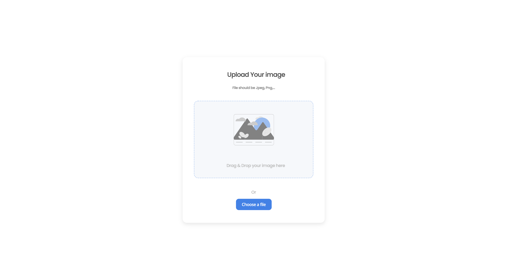

<!-- Please update value in the {}  -->

<h1 align="center">Image Uploader</h1>

<div align="center">
   Solution for a challenge from  <a href="http://devchallenges.io" target="_blank">Devchallenges.io</a>.
</div>

<div align="center">
  <h3>
    <a href="https://image-uploader-cyyeh.netlify.app/">
      Demo
    </a>
    <span> | </span>
    <a href="https://github.com/cyyeh/image-uploader">
      Solution
    </a>
    <span> | </span>
    <a href="https://devchallenges.io/challenges/O2iGT9yBd6xZBrOcVirx">
      Challenge
    </a>
  </h3>
</div>

<!-- TABLE OF CONTENTS -->

## Table of Contents

- [Table of Contents](#table-of-contents)
- [Overview](#overview)
  - [Built With](#built-with)
- [Features](#features)
- [How To Use](#how-to-use)
- [Acknowledgements](#acknowledgements)
- [Contact](#contact)

<!-- OVERVIEW -->

## Overview


### Built With

- Vanilla JavaScript
- AWS S3 JavaScript library
- Netlify Functions

## Features

This application/site was created as a submission to a [DevChallenges](https://devchallenges.io/challenges) challenge. The [challenge](https://devchallenges.io/challenges/O2iGT9yBd6xZBrOcVirx) was to build an application to complete the given user stories.

## How To Use

```bash
# Clone this repository
$ git clone https://github.com/cyyeh/image-uploader

# Install dependencies
$ yarn install

# Setup S3 instance and have a new .env file from .env.example
# Fill in environment variables
$ cp .env.example .env

# Run the app
$ yarn dev
```

## Acknowledgements

## Contact

- Website [linktr.ee/cyyeh](https://linktr.ee/cyyeh)
- GitHub [@cyyeh](https://{github.com/cyyeh})
- Twitter [@ChihYuNewRich](https://twitter.com/ChihYuNewRich)
